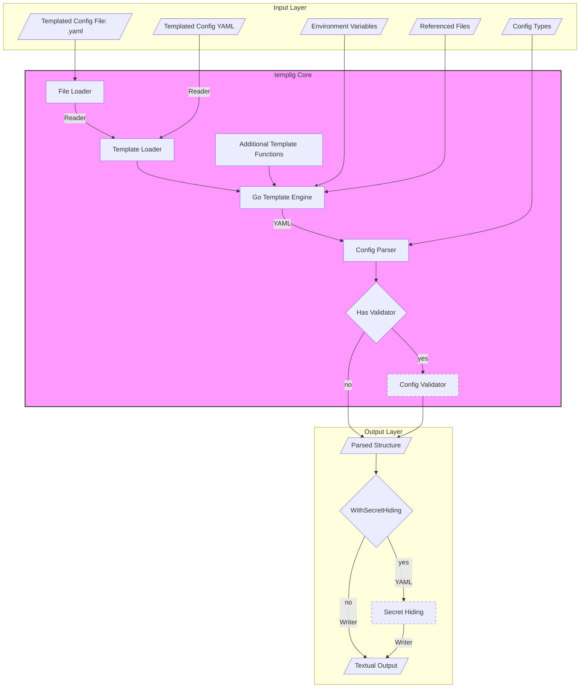

<!-- SPDX-FileCopyrightText: 2026 The templig contributors.
     SPDX-License-Identifier: MPL-2.0
-->

Architecture
============

*templig* is an easy-to-use configuration library. It hides the details of
loading files, expanding templating expressions and potential validation steps
from the programmer and user.

The loading of a configuration is explicated in the following picture:

*templig* utilizes Go generics to ensure type safety. The Config Types provided
at the input layer act as a blueprint for the Config Parser. This ensures that
the rendered output is not only syntactically correct but also semantically
compliant with the user's expected data structure.

The *templig* Core operates entirely in-memory and does not require network
access. All inputs (templates, environment variables) are processed through the
Go template engine before being validated against the expected structure. Should
a *templig* user decide to extend the core with functionality violating this
promise it is outside the scope of this document and project.
